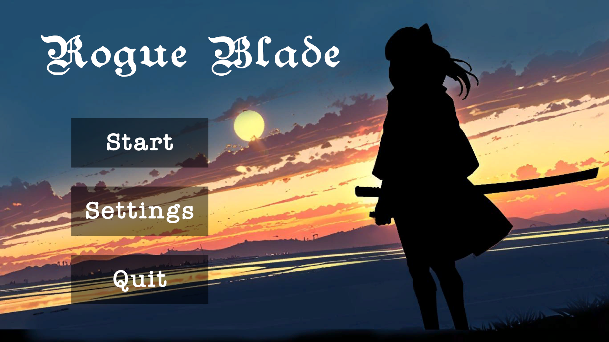
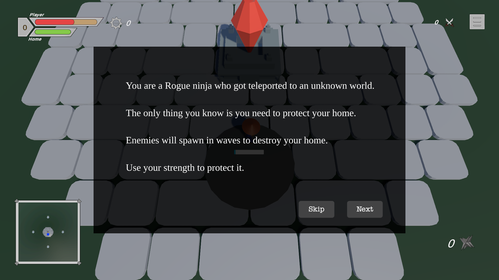
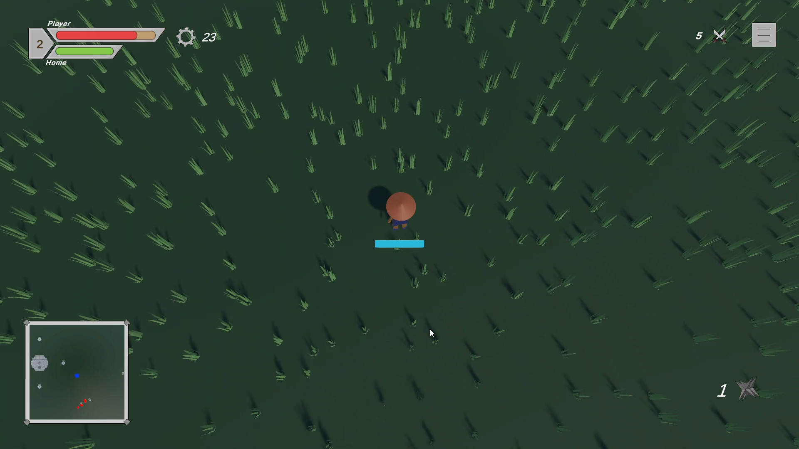
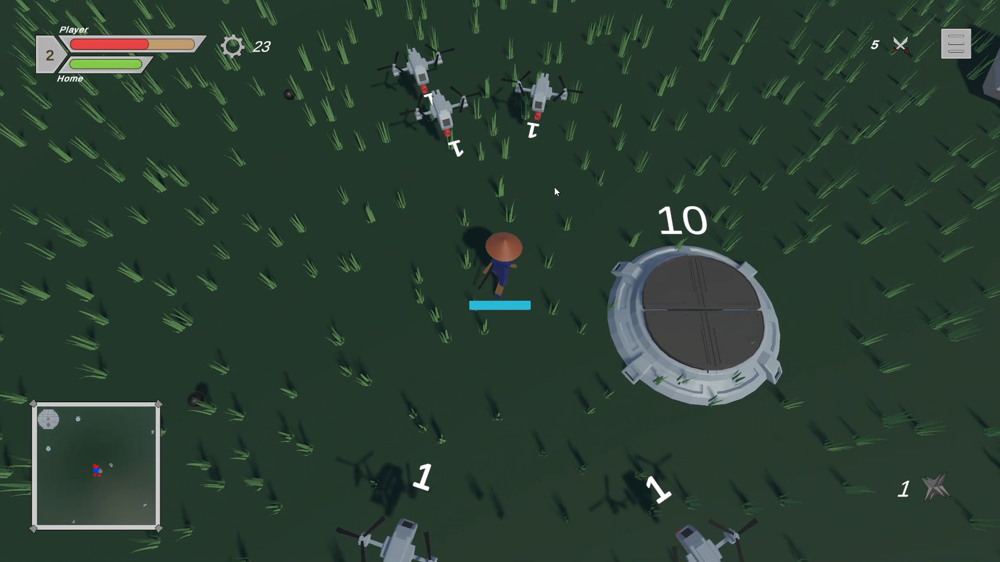
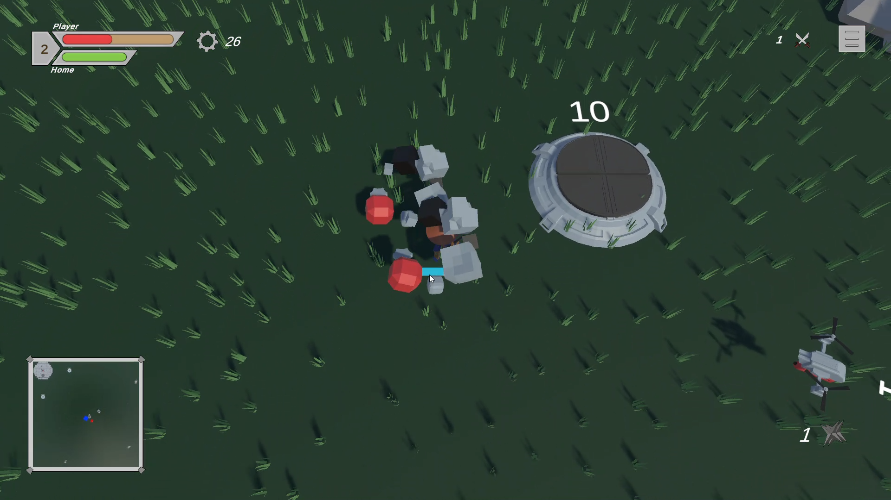
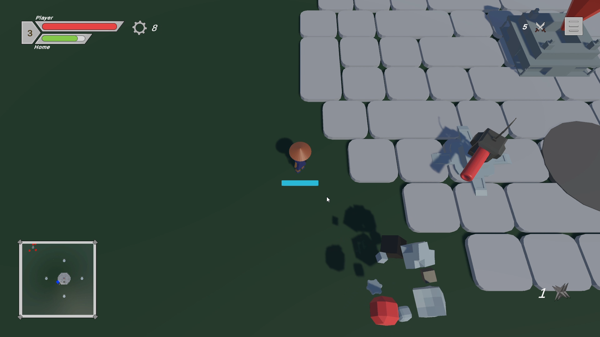
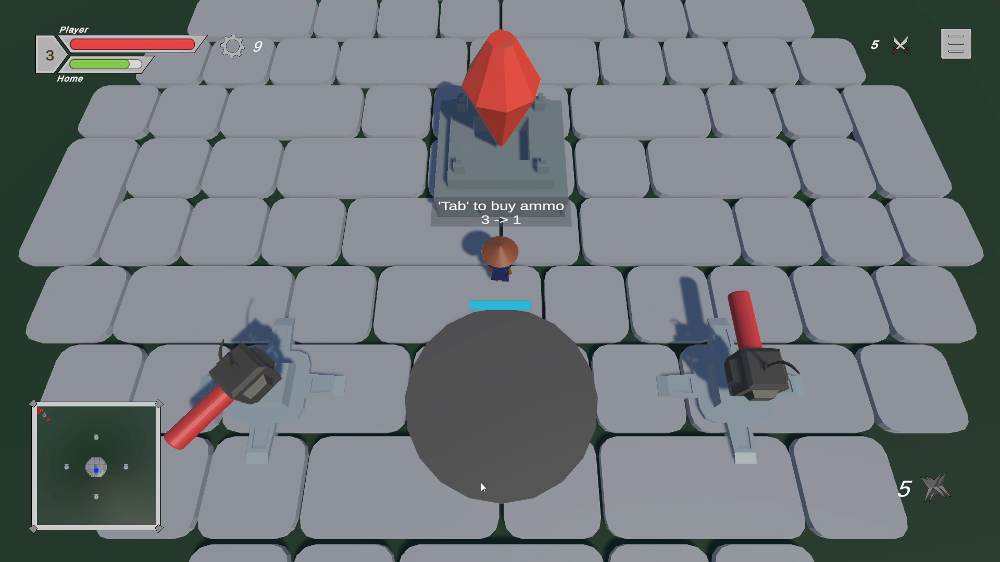

# 🎮 Rogue Blade

This is top-down wave type action game.

## 📦 About the Project

Rogue Blade is a top down wave type game where you need to protect your home from enemies. Each wave will have more number of enemies and player can buy blades and turrets to protect the home.

## 🛠️ Built With

- [Unity](https://unity.com/)
- [C#](https://docs.microsoft.com/en-us/dotnet/csharp/)
- [Built-in Render Pipeline](https://unity.com/releases/editor/whats-new)

## 🎮 Gameplay

> - **Genre**: Puzzle Platformer  
> - **Controls**:  
>     - Move: `W A S D`  
>     - Dash: `Shift`  
>     - Interact: `E`
>     - Attack: `Left-Click`
>     - Throw: `Right-Click`

## 🖼️ Screenshots

  
  
  
  
  
  

## 🎥 Gameplay Video

👉 [Gameplay Trailer](https://youtu.be/0GCCgmywXb0)
